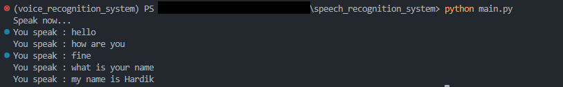

# Real-Time Speech Recognition
This Python code uses the Google Speech Recognition API to perform real-time speech recognition from an audio input source. The program continuously listens to the microphone input and prints any recognized speech to the console.


## Installation

1. Ensure that Python is installed on your computer. If it is not installed, download it from the official website: https://www.python.org/downloads/.

2. Open a command prompt or terminal window and navigate to the directory where you want to install the project.

3. Clone the project repository from GitHub using the following command:
```bash
git clone https://github.com/hardikRumbum/speech_recognition_system.git
```
4. Install the required Python libraries using pip. Run the following command in your command prompt or terminal window:

```bash
  pip install -r requirements.txt
```
  This will install all the necessary libraries listed in the requirements.txt file.

5. You are now ready to run the project. Depending on the project, you may need to run a main.py file to start the project. To run this project, use the following command:

```bash
python main.py
```

Congratulations 🎉 Your program has run successfully. Enjoy!

**If you encounter any errors or have any doubts, feel free to ask me in the "Issues" section.


    
## Usage/Examples

This system is used to perform real-time speech recognition and convert voice data into text format. The program provides live speech-to-text conversion from the microphone input.

Result:
